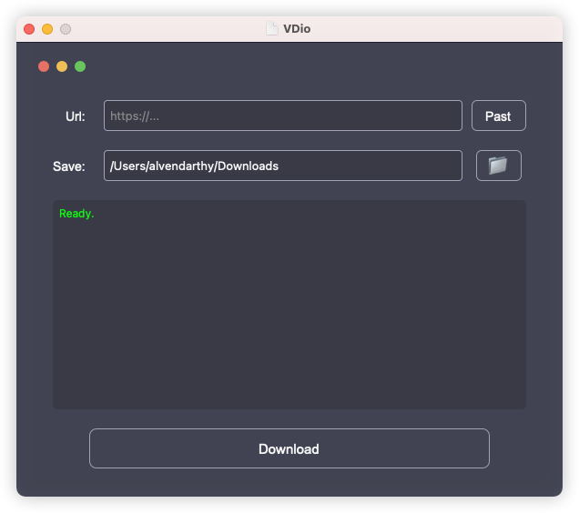

# VDio
a python3 GUI for yt-dlp

# install
1. download the [yt-dlp](https://github.com/yt-dlp/yt-dlp/releases) binary to your host and add it to the system PATH.
2. `run.command` for mac os, `python3 main.py` for others.
